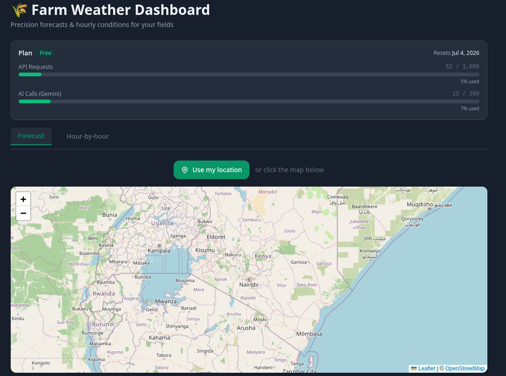
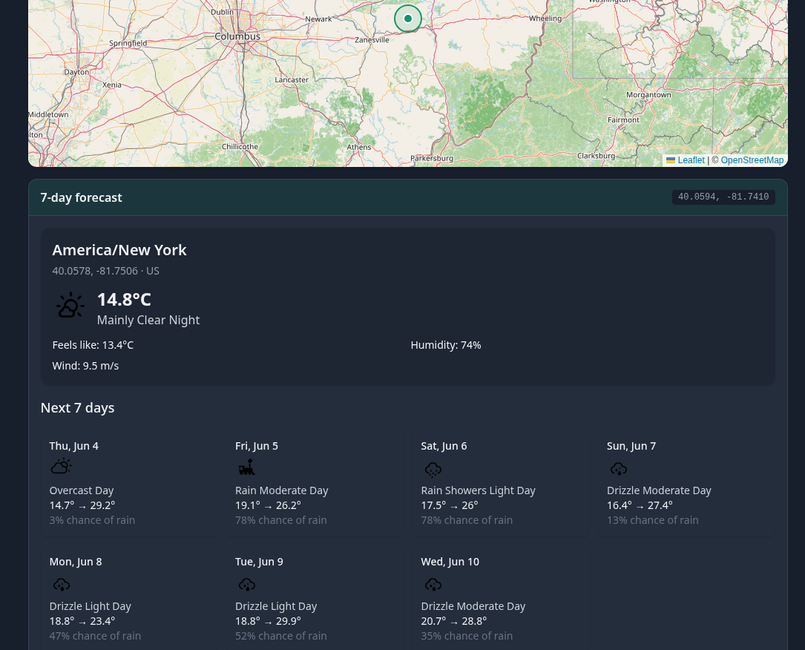
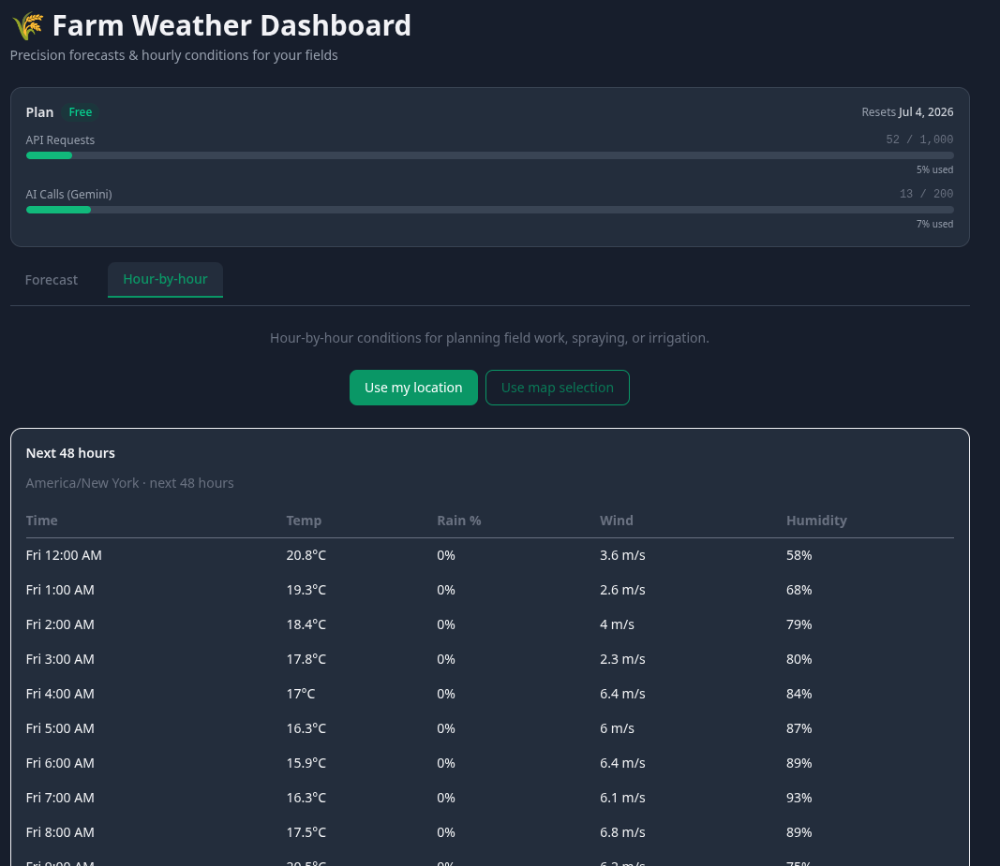

# 🌾 Agriweather-AI

**Live demo:** [agriweather-ai.netlify.app](https://agriweather-ai.netlify.app/)  
**Repository:** [github.com/TristanBrian/Agriweather-AI](https://github.com/TristanBrian/Agriweather-AI.git)

A **production‑grade weather dashboard for precision agriculture**, powered by the [Weather AI](https://weather-ai.co/docs) API.  
Click anywhere on the interactive map for a hyperlocal 7‑day forecast with AI‑generated summaries, dive into 48 hours of hourly data, upload a farm image to count trees and assess canopy health, and monitor your API quota in real time — all behind a secure, cache‑optimised serverless proxy built for scale.

---

## 📸 Preview

[](https://agriweather-ai.netlify.app/)

*Click the image to open the live demo.*  
*More screenshots: forecast cards, hourly view, tree analysis.*



---

## ✨ Features

- **Interactive Map** – Leaflet + OpenStreetMap; click anywhere to fetch forecasts instantly.
- **7‑Day Forecast** – daily highs/lows, conditions, and Gemini AI summaries.
- **48‑Hour Hourly Breakdown** – temperature, precipitation, wind, and humidity — perfect for planning fieldwork.
- **Tree Analysis** 🌳 – upload a drone or satellite image to get tree count, canopy coverage, health breakdown, and agronomic recommendations (free tier: 5 analyses/month).
- **Geolocation** – one‑click “Use my location” via Weather AI’s IP endpoint.
- **Live Usage Bar** – plan info, request counts, quota reset date; updates automatically after every API call.
- **Dark / Light Mode** – toggle that persists across sessions (localStorage).
- **API Proxy Layer** – all Weather AI calls go through Next.js API routes:
  - 10‑minute in‑memory cache (ready for Redis/Upstash)
  - Per‑IP rate limiting (10 req/min)
  - Cache invalidation to keep usage data fresh
  - No API key exposed to the browser
- **Responsive & Accessible** – works on mobile, tablet, and desktop.

---

## 🔗 API Integration

| Weather AI Endpoint   | App Route            | Purpose                           | Caching  | AI usage         | Notes |
|-----------------------|----------------------|-----------------------------------|----------|------------------|-------|
| `/v1/forecast`        | `/api/weather`       | 7‑day daily forecast              | 10 min   | Yes (summaries)  | |
| `/v1/weather-geo`     | `/api/weather/geo`   | Auto‑detect location forecast     | 10 min   | No (saves quota) | |
| `/v1/hourly`          | `/api/hourly`        | 48‑hour granular breakdown        | 10 min   | No               | |
| `/v1/usage`           | `/api/usage`         | Plan, quota, billing period       | 15 sec*  | N/A              | |
| `/v1/trees/analyze`   | `/api/trees`         | Tree counting & canopy health     | none     | N/A              | Free: 5/month |

> *Usage route caches for 15 seconds to prevent hitting our own rate limiter while staying near‑real‑time.  
> Tree analysis is limited to **5 requests per month** on the free plan — a live deployment will show a usage limit message when quota is exhausted.

All responses are **normalised** in the proxy — for example, the nested `/v1/usage` response is flattened before reaching the client.

---

## 🧠 Architecture & Scaling

- **Server‑side Proxy** – API key never reaches the browser; caching, rate limiting, and error normalisation happen in one place.
- **Caching Strategy** – Weather data is cached for 10 minutes (matching API update intervals). Usage data is cached for 15 seconds with **cache invalidation** after every successful weather call, keeping the quota bar accurate.
- **Rate Limiting** – Per‑IP sliding window (10 req/min). In production, this can be swapped for a Redis‑backed global limiter like `@upstash/ratelimit`.
- **Ready to Scale** – The in‑memory cache (`src/lib/cache.ts`) can be replaced with **Upstash Redis** without changing its interface.

---

## 🚀 Quick Start

### Prerequisites
- **Node.js** ≥ 18
- A **Weather AI API key** from [weather-ai.co](https://weather-ai.co) → Dashboard → API Keys

### 1. Clone & Install
```bash
git clone https://github.com/TristanBrian/Agriweather-AI.git
cd Agriweather-AI
npm install
```

### 2. Configure Environment
```bash
cp .env.example .env.local
```
Edit `.env.local`:
```
WEATHER_AI_API_KEY=wai_your_actual_key
```

### 3. Run Locally
```bash
npm run dev
```
Open [http://localhost:3000](http://localhost:3000).

---

## 🚢 Deploy to Netlify

### One‑click Deploy
[](https://app.netlify.com/start/deploy?repository=https://github.com/TristanBrian/Agriweather-AI)

After clicking the button, set the environment variable:
- **Key:** `WEATHER_AI_API_KEY`
- **Value:** your Weather AI key

Netlify auto‑detects Next.js — no extra configuration needed.

### Manual Deployment
1. Push the repository to GitHub.
2. In Netlify, **Add new site → Import an existing project**.
3. Connect the repo and add the `WEATHER_AI_API_KEY` environment variable.
4. Deploy! Netlify uses `next build` by default.

---

## 📁 Project Structure

```
src/
├── app/
│   ├── api/
│   │   ├── weather/         # GET forecast
│   │   ├── weather/geo/     # GET IP‑based forecast
│   │   ├── hourly/          # GET hourly data
│   │   ├── usage/           # GET usage & quota
│   │   └── trees/           # POST tree analysis
│   ├── layout.tsx
│   └── page.tsx             # Main dashboard
├── components/
│   ├── Map.tsx              # Interactive Leaflet map
│   ├── WeatherDisplay.tsx   # Current + 7‑day cards
│   ├── HourlyPanel.tsx      # 48‑hour scrollable view
│   ├── UsageBar.tsx         # Quota bars & plan info
│   ├── Tabs.tsx             # Forecast / Hourly / Tree tabs
│   └── TreeUploader.tsx     # Image upload & result display
├── lib/
│   ├── weather-ai.ts        # Axios client, auth, error handling
│   ├── cache.ts             # In‑memory TTL cache + invalidation
│   └── rate-limiter.ts      # Per‑IP sliding window
└── types/
    └── index.ts             # Shared TypeScript interfaces
```

---

## 🧪 How to Test

1. **Forecast tab** – click the map or **Use my location** → 7‑day forecast appears.
2. **Hour‑by‑hour tab** – 48 hours of granular weather data loads for the same location.
3. **Tree Analysis tab** – upload a farm image (JPEG/PNG) → tree count, health, and recommendations appear. (Free plan allows 5/month; after that, a usage limit message will be shown.)
4. **Usage bar** (top of page) – updates after every weather request to show live quota.

---

## 📦 Tech Stack

| Layer       | Technology |
|-------------|------------|
| Framework   | Next.js 14 (App Router) |
| Language    | TypeScript |
| Styling     | Tailwind CSS (`darkMode: 'class'`) |
| HTTP Client | Axios |
| Map         | Leaflet + react‑leaflet |
| Deployment  | Netlify |
| Caching     | In‑memory (swap to Redis/Upstash) |

---

## 📄 License

MIT — use freely for your own Weather AI integrations.

---

## 👨‍🌾 About

Made with ☕ by **Brian Kioko** — built for the Weather AI engineering challenge.

*If you have questions about the architecture or would like to discuss scaling further, feel free to reach out.*
```